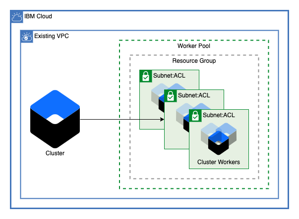

# VPC Cluster Edge Pool

This module creates an edge pool for an existing cluster on IBM VPC. This module can be used to create a pool for both IKS and OpenShift clusters.

---

## Table of Contents

1. [Edge Pool](##edge-pool)
2. [Module Variables](##Module-Variables)

---

## Edge Pool

### Prerequisites

In order to create a pool, you must have a cluster running on an IBM VPC with at least one subnet.

### Worker Pool

A single worker pool will be added to an existing cluster with the workers on any number of subnets within the existing VPC. For OpenShift Clusters and for high availability on IKS Clusters, you must create at least two workers per zone.

---

## Module Variables

Variable         | Type         | Description                                                                                                                                                                                                                                                                                                                                                                                                                                                                                                                           | Default
---------------- | ------------ | ------------------------------------------------------------------------------------------------------------------------------------------------------------------------------------------------------------------------------------------------------------------------------------------------------------------------------------------------------------------------------------------------------------------------------------------------------------------------------------------------------------------------------------- |--------
ibmcloud_api_key | string       | The IBM Cloud platform API key needed to deploy IAM enabled resources                                                                                                                                                                                                                                                                                                                                                                                                                                                                 |
ibm_region       | string       | IBM Cloud region where all resources will be deployed                                                                                                                                                                                                                                                                                                                                                                                                                                                                                 |
resource_group   | string       | Name for IBM Cloud Resource Group where resources will be deployed                                                                                                                                                                                                                                                                                                                                                                                                                                                                    |
vpc_name         | string       | Name of the VPC where the cluster will be provisioned                                                                                                                                                                                                                                                                                                                                                                                                                                                                                 |
subnet_names     | list(string) | A list of subnet names for the edge worker pool. These subnets must exist within your VPC                                                                                                                                                                                                                                                                                                                                                                                                                                             |
cluster_name     | string       | Name of the cluster where resources will be deployed                                                                                                                                                                                                                                                                                                                                                                                                                                                                                  |
edge_pool_name   | string       | Name for the edge pool to be created                                                                                                                                                                                                                                                                                                                                                                                                                                                                                                  | `"edge-pool"`
machine_type     | string       | The flavor of VPC worker nodes to use for your edge pool                                                                                                                                                                                                                                                                                                                                                                                                                                                                              | `"bx2.4x16"`
workers_per_zone | number       | Number of workers to provision in each subnet. Openshift clusters require at least 2 workers.                                                                                                                                                                                                                                                                                                                                                                                                                                         | `2`
entitlement      | string       | Change this field to an empty string if not using an OpenShift Cluster. If you purchased an IBM Cloud Cloud Pak that includes an entitlement to run worker nodes that are installed with OpenShift Container Platform, enter entitlement to create your cluster with that entitlement so that you are not charged twice for the OpenShift license. Note that this option can be set only when you create the cluster. After the cluster is created, the cost for the OpenShift license occurred and you cannot disable this charge.   | `"cloud_pak"`